# Getting Started with APRS over LoRa

If you want to participate in the APRS network and live in the greater Hornsby area, you might want to get started using APRS over LoRa. It has the advantage of being relatively affordable and simple to set up.

At a minimum you probably want to get a LoRa Tracker so you can send position beacons into the network.

If your area is not well covered by existing iGates you might want also set up an iGate to extend the coverage.

If you haven't done anything with APRS and want to get an idea of what is about you can simply use yor web browser to visit on of the common APRS web sites.

Once you are set up you may want to dig further into APRS. You can find some useful references at [[APRS Resources]]

## Visit aprs.fi

To get an idea of the kind of information available via APRS just go the the [aprs.fi](https://aprs.fi) web site.

If you search for VK2RNS-10 in the **Track Callsign** field at the top right you can see our APRS LoRa iGate at the VK2RNS repeater site. You can also look at VK2RNS and see telemetry for the site.

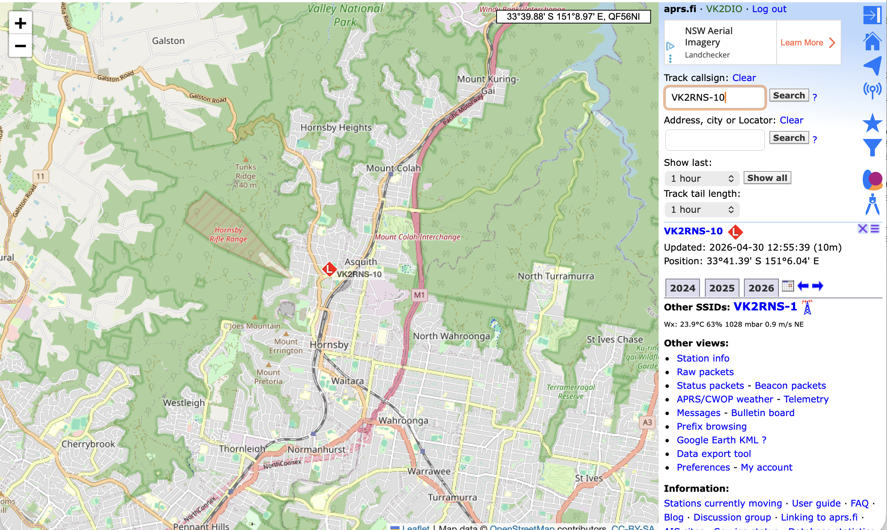

## Buy Hardware

You can use an number of common microcontroller boards with LoRa transceivers. I have had good success with the [Heltec Wireless Tracker](https://heltec.org/project/wireless-tracker) and the [Heltec Wireless Stick Lite](https://heltec.org/project/wireless-stick-lite-v2/).

There are a number of sellers on Aliexpress just be sure to buy the 433 MHz variant

Here are two examples

[Heltec Wireless Tracker on Aliexpress](https://www.aliexpress.com/item/1005005681504175.html?gps-id=pcFullPieceDiscount&scm=1007.24625.271276.0&scm_id=1007.24625.271276.0&scm-url=1007.24625.271276.0&pvid=7590b876-745c-48d0-9c8a-936fc157a6a9&_t=gps-id%3ApcFullPieceDiscount%2Cscm-url%3A1007.24625.271276.0%2Cpvid%3A7590b876-745c-48d0-9c8a-936fc157a6a9%2Ctpp_buckets%3A668%232846%238108%231977&pdp_ext_f=%7B%22order%22%3A%221202%22%2C%22eval%22%3A%221%22%2C%22sceneId%22%3A%2214625%22%2C%22fromPage%22%3A%22recommend%22%7D&pdp_npi=6%40dis%21AUD%2150.13%2135.59%21%21%2135.41%2125.14%21%402103110517774387348766701e5ea4%2112000049102156992%21rec%21AU%216226148088%21XZ%211%210%21n_tag%3A-29919%3Bd%3Adb03186a%3Bm03_new_user%3A-29895&spm=a2g0o.store_pc_home.fullPieceDiscountPromo_2014046725751.1005005681504175) (Buy the 433 MHz Glue variant)

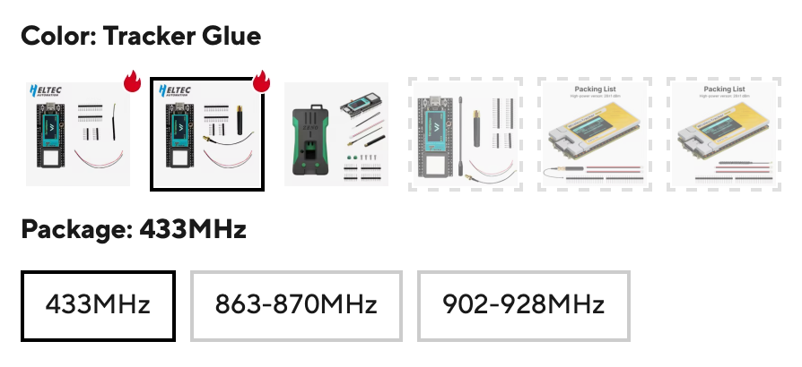

[Heltec Wireless Stick Lite on Aliexpress](https://www.aliexpress.com/item/1005005443311259.html?gps-id=pcFullPieceDiscount&scm=1007.24625.271276.0&scm_id=1007.24625.271276.0&scm-url=1007.24625.271276.0&pvid=9d872304-e153-4c28-9ddc-2639443f41bc&_t=gps-id%3ApcFullPieceDiscount%2Cscm-url%3A1007.24625.271276.0%2Cpvid%3A9d872304-e153-4c28-9ddc-2639443f41bc%2Ctpp_buckets%3A668%232846%238108%231977&pdp_ext_f=%7B%22order%22%3A%22315%22%2C%22eval%22%3A%221%22%2C%22sceneId%22%3A%2214625%22%2C%22fromPage%22%3A%22recommend%22%7D&pdp_npi=6%40dis%21AUD%2135.20%2124.99%21%21%2124.86%2117.65%21%402103110517774388498458892e5ea4%2112000044838334612%21rec%21AU%216226148088%21XZ%211%210%21n_tag%3A-29919%3Bd%3Adb03186a%3Bm03_new_user%3A-29895&spm=a2g0o.store_pc_home.fullPieceDiscountPromo_2014046725751.1005005443311259) (Buy the 433 MHz Glue variant)

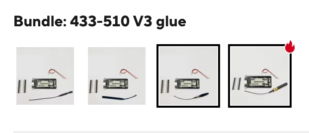

## Set up LoRa APRS Tracker

## Flash the Software

We are using the APRS LoRa software from CA2RXU

The Heltec Wireless Tracker is the preferred device for a tracker as it has a GPS receiver and a display.You could use a Wireless Stick Lite if you just want to use the tracker as a TNC for a mobile app

Go to https://richonguzman.github.io/lora-tracker-web-flasher/installer.html. It is best to use Chrome for this.

Select the following:

**Board:** `Heltec Wireless Tracker` (Match your board type)

**Firmware Version:** `V2.4.3.2 (22 April 2026)` (Use the latest version)

**Type:** `First Flash or Factory reset (web_factory.bin)`

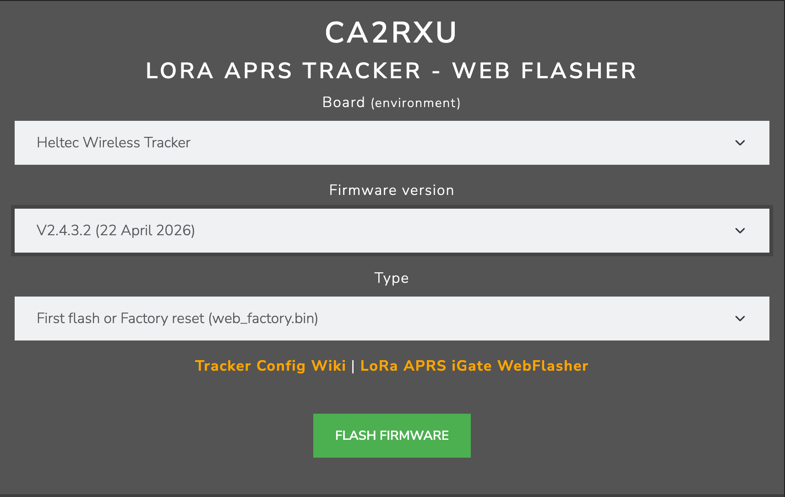

Click on **Flash Firmware**

Select the appropriate *Serial Port* and click **Connect**

Select `heltec_wireless_tracker factory.json`

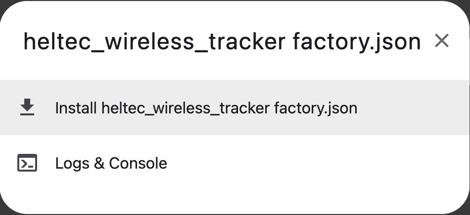

## Configure the Tracker

Once the flashing is complete the Tracker should go into WiFi AP mode and start it's Web Configuration Server

On yor computer open the WiFi settings and connect to the Tracker

**SSID:** `LoRaTracker-AP`
**Passphrase:** `1234567890`

Open the Configuration web page at [http://192.168.4.1](http://192.168.4.1)

**Optional** *Download [this configuration backup file](https://github.com/VK2MA/HowTos/blob/main/TrackerConfigurationBackup.json) and restore it to the device and just change the Callsign settings*

Apply the following minimum settings:

**Beacons -> 1) -> Callsign:** `VK2xxx-7` (Use your Callsign)

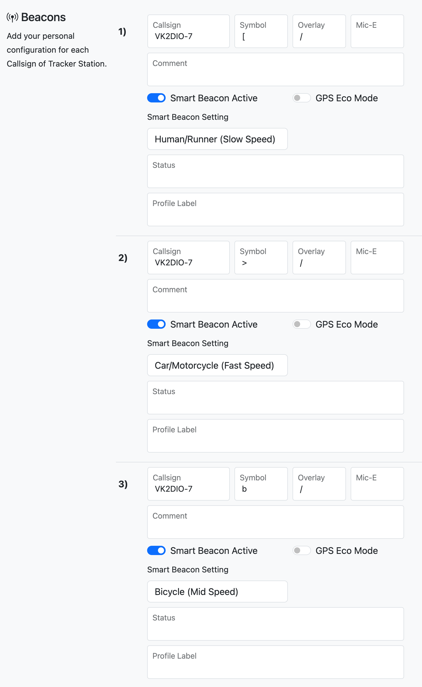

**Station Config Path:** `WIDE1-1,WIDE2-1`

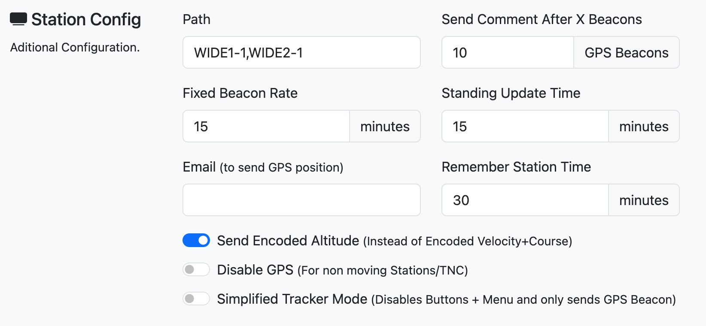

**LoRa -> 1) -> Frequency:** `433775000`

**LoRa -> 1) -> SF:** `12`

**LoRa -> 1) -> CR4:** `5`

**LoRa -> 1) -> BW:** `125000`

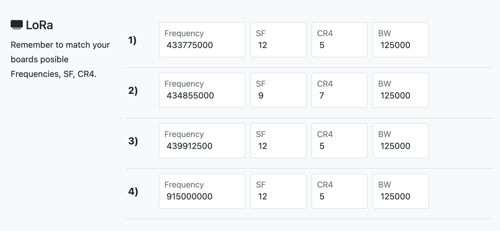

Click **Save** and the Tracker will reboot into operational mode

## Set up LoRa APRS iGate

*This is optional, your tracker might be able to reach existing iGates*

## Flash the Software

We are using the APRS LoRa software from CA2RXU

The Heltec Wireless Stick Lite is the preferred device for an iGate as the GPS receiver and display are not needed.

Go to https://richonguzman.github.io/lora-igate-web-flasher/installer.html 

Select the following:

**Board (Environment):** `Heltec Wireless Stick Lite V3/3.2` (Match your board type)

**Firmware Version:** `V3.2.4 (21 April 2026)` (Use the latest version)

**Type:** `First Flash or Factory reset (web_factory.bin)`

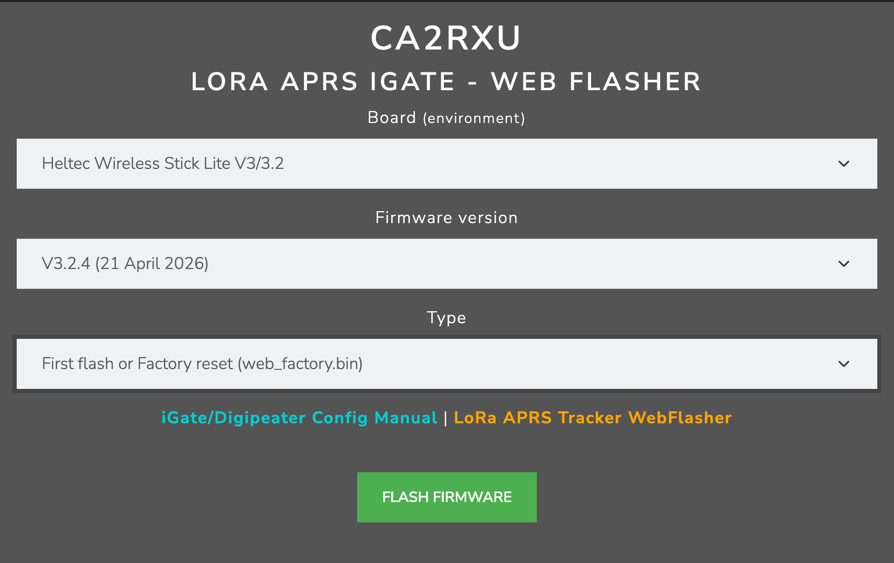

Select the appropriate *Serial Port* and click **Connect**

Select `heltec_wireless_stick_lite_v3 factory.json`

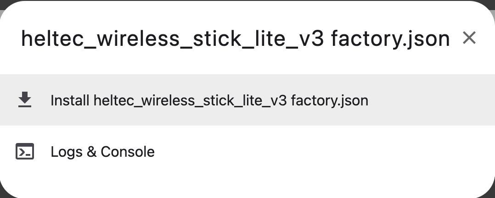

## Configure the iGate

Once the flashing is complete the iGate should go into WiFi AP mode and start it's Web Configuration Server

On yor computer open the WiFi settings and connect to the iGate

**SSID:** `NOCALL-10 AP`
**Passphrase:** `1234567890`

Open the Configuration web page at [http://192.168.4.1](http://192.168.4.1)

Apply the following minimum settings:

**Station -> Callsign SSID:** `VK2xxx-10` (Use your Callsign)

**Station -> Beacon Path:** `WIDE2-1`

**Station -> Latitude:** `-33.66000` (Use your Latitude)

**Station -> Longditude:** `151.12000` (Use your Longditude)

**WiFi Access SSID:-> :** (Use your home WiFi SSID)

**WiFi Access SSID:-> :** (Use your home WiFi Passphrase)

**APSR-IS -> Enable APRS-IS connection:** `Activate Enable`

**APSR-IS -> Gate APRS-IS Messages to RF:** `Activate Enable`

**APSR-IS -> Passcode:** Based on your callsign, generate it at https://lora-aprs.live/aprs-passcode.html

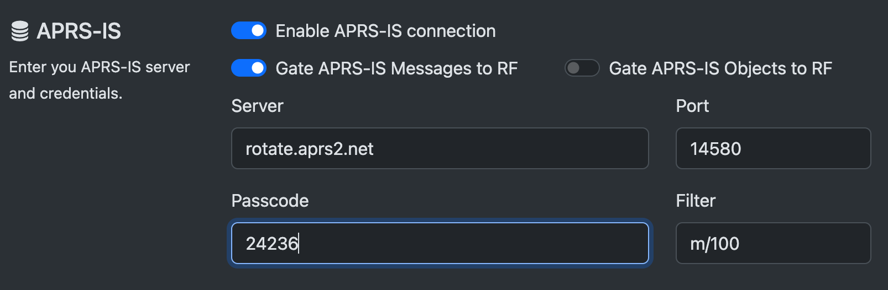

**LoRa parameters as per the screenshot below**

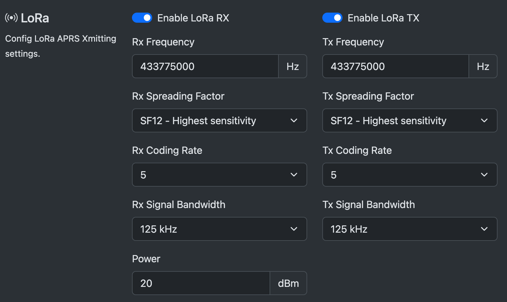

Click **Save** and the iGate will reboot into operational mode and should connect to APRS-IS over your WiFi