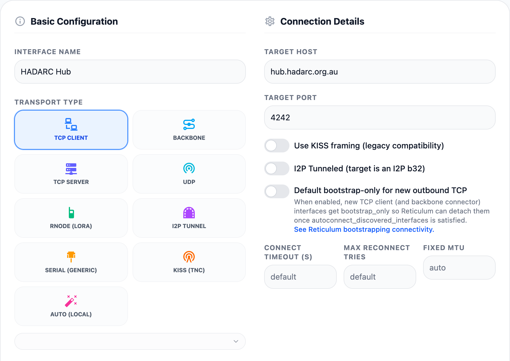
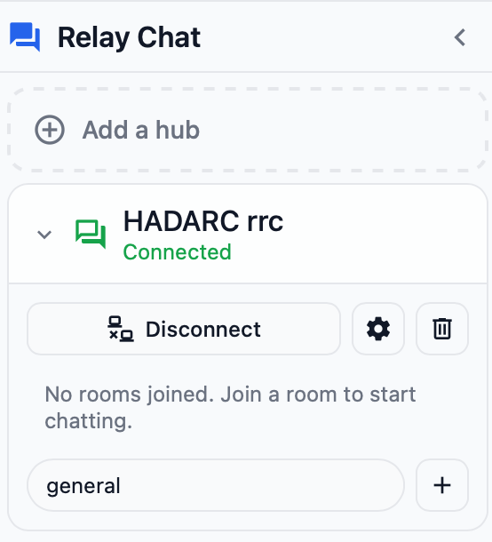
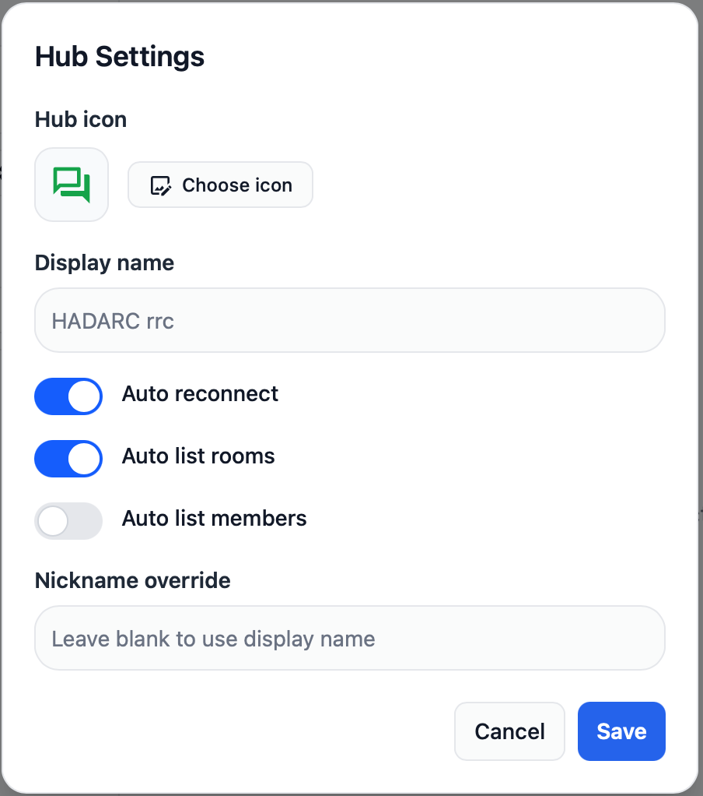

# Getting Started with Reticulum
## Installing and Configuring an LXMF (Messaging) client

In this example we will be installing the [Reticulum MeshChatX](https://meshchatx.com) app that is available for Mac, Linux and Windows.

Go to [Reticulum MeshChatX](https://meshchatx.com) then download and install the most recent version of the app for your operating system.

Run the program and go to the **Interfaces** section.

Click on **+ Add Interface** and configure it as follows:

**Name:** `HADARC Hub`

**Type:** `TCP Client`

**Target Host:** `hub.hadarc.org.au`

**Target Port:** `4242`

Expand the section called **Advanced Parameters (IFAC, Mode)** and set the **INTERFACE ACCESS CODE (IFAC)**

**Network Name:** `HADARC`
 
**Passphrase:** _Leave Blank_

Click on **Add interface**

Click on **Restart Now**

## Start Messaging

Go to the **Messages** section

In the second column click on **ANNOUNCES**

You should see a list of LXMF destinations you can try. Just click on one that looks interesting and has announced recently then type and send a message.

You can try joining a group chat at LXMF address `401ceb4c5df4c9469df396d821cff138`

## Browse a Page on the Nomad Network

Go to the **Nomad Network** section

Click on **Open a Nomadnet URL**

Enter `429572a04001a8023bf4c2518e34f95b`

Alternately look for recently seen nodes in the **Announces** list.

## Join a Reticulum Relay Chat

Go to the **Relay Chat** section

Click on **Add a hub**

Under **Hub Destination Hash** enter `e7fd7f9efd6608ca4ade879d18646eed` then click **Add Hub**

In the **Room Name** field enter `general` and click the **+** then click on **# general** and start chatting.

Follow the links on the Home Page, similar to using a web browser

Click on the gear icon and Select **Auto List Rooms**

## Add an RF interface
This is where Reticulum starts to make sense for Amateurs, using RF to carry the data.

The simplest place to start is to use an RNode. These use common Microcontroller dev boards with LoRa radios in the ISM band.

I have had good results with the Heltec Wireless Stick Lite which can easily be purchased online.

We are using the following settings for LoRa

## What's Next

Reticulum is more than a messaging system, it's a complete network stack supporting just about anything that runs over networks. This includes things like file transfers and even real time traffic such as voice and video.

Probably the most interesting aspect for Amateur Radio enthusiasts is the ability of Reticulum to work over low speed radio links.

To that end a number of HADARC members are setting up LoRa radios around the Hornsby area. If you are interested in participating please follow this guide and send a message to the **HADARC LXMF Group** asking how to set up an RNode and where the existing RNodes are located

Read more at [https://reticulum.network](https://reticulum.network)
